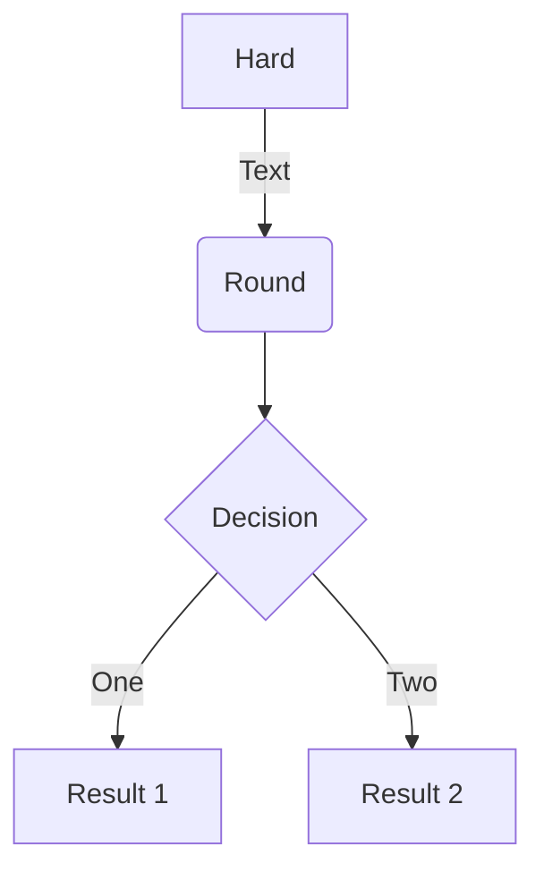

# KH75
My Java Exercises 4 KH

```mermaid
flowchart TD

    A[Hard] -->|Text| B(Round)
    B --> C{Decision}
    C -->|One| D[Result 1]
    C -->|Two| E[Result 2]
```

```plantuml
start
:Hello;
:World;
if (condition) then (yes)
stop
```
